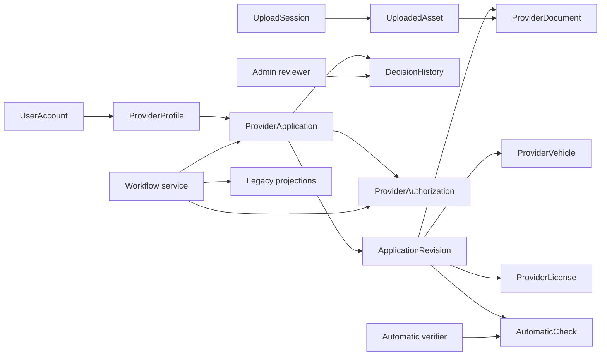
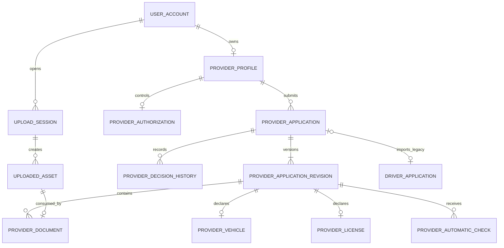
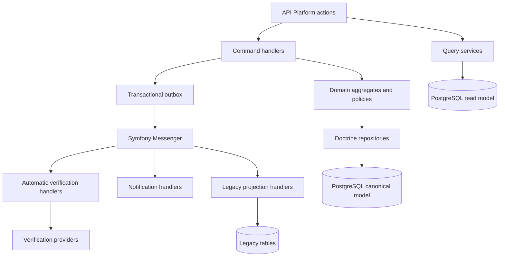
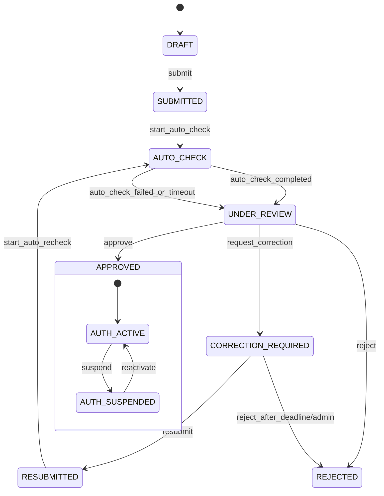

# Architecture cible progressive - Validation des Prestataires

Date : 9 juin 2026

Document source :
`docs/provider-validation-architecture-audit.md`

## 0. Positionnement

Ce document ne propose pas une reconstruction depuis une feuille blanche. Il part des elements
verifies dans l'audit :

- `user_account` reste le compte et le point d'identite;
- `provider_profile` existe deja et porte les activites;
- `driver_application` et ses tables filles contiennent les dossiers detailles existants;
- les endpoints historiques doivent rester disponibles;
- Android utilise deja certains contrats historiques;
- les JWT mobiles utilisent `uid`, `typ` et `token_version`;
- le stockage Supabase et la validation locale des fichiers existent;
- le tracking GPS contient deja une premiere policy d'acces pour un livreur approuve.

La strategie est additive :

1. introduire un modele canonique a cote de l'ancien;
2. alimenter les projections historiques;
3. migrer les lectures puis les ecritures;
4. deprecier seulement apres observation et fin de support des anciennes applications.

Le projet Android n'est pas present dans le workspace. Les recommandations Android de ce
document sont donc des contrats cibles a valider contre le code Java reel avant implementation.

## 1. Principes de decision

### 1.1 Trois concepts differents

Le workflow cible ne peut etre fiable que si trois notions sont separees.

#### Profil Prestataire

Le profil decrit ce que l'utilisateur souhaite et sait exercer :

- livraison;
- transport de personnes;
- informations publiques ou professionnelles durables;
- lien avec le compte utilisateur.

Il existe independamment d'une campagne de verification particuliere. Une correction de document
ne doit pas recreer le profil.

#### Dossier de validation

Le dossier est une demande versionnee et auditable :

- donnees soumises;
- documents examines;
- vehicule et permis declares;
- controles automatiques;
- decisions administratives;
- corrections et resoumissions.

Une approbation ou un rejet porte sur une version precise du dossier.

#### Autorisation operationnelle

L'autorisation repond a la question : "quelles operations ce Prestataire peut-il effectuer
maintenant ?"

Elle depend :

- d'un dossier approuve;
- des activites approuvees;
- d'une suspension eventuelle;
- de contraintes futures : document expire, assurance expiree, fraude, abonnement ou zone.

Une suspension ne doit pas modifier retrospectivement la decision du dossier approuve.

### 1.2 Correction de la liste d'etats demandee

La liste cible contient `SUSPENDED` dans le workflow du dossier. Cette valeur est utile pour
Android, mais elle ne doit pas devenir l'etat canonique d'une candidature.

Modele retenu :

- `ProviderApplication.status` :
  `DRAFT`, `SUBMITTED`, `AUTO_CHECK`, `UNDER_REVIEW`, `CORRECTION_REQUIRED`,
  `RESUBMITTED`, `APPROVED`, `REJECTED`;
- `ProviderAuthorization.status` :
  `INACTIVE`, `ACTIVE`, `SUSPENDED`;
- `effectiveStatus`, expose par l'API :
  retourne `SUSPENDED` si l'autorisation est suspendue, sinon l'etat de la candidature.

Cette separation respecte le besoin fonctionnel sans confondre decision de conformite et
sanction operationnelle.

## 2. Cartographie du domaine

### 2.1 Bounded contexts

Le monolithe Symfony reste deploye comme une seule application. Les frontieres suivantes sont
logiques et organisationnelles, pas des microservices.

| Contexte | Responsabilite | Elements existants reutilises |
|---|---|---|
| Identity & Access | Compte, OTP, JWT, roles, sessions | `UserAccount`, `OtpService`, `JwtAuthService` |
| Provider Profile | Activites et informations durables | `ProviderProfile` |
| Provider Validation | Dossier, revisions, documents, controles, decisions | `driver_application` comme source legacy |
| Provider Operations | Capacites effectives, suspension, reactivation | Policy GPS existante a generaliser |
| Document Storage | Upload, possession, validation technique, URL signee | Supabase, `UploadedFileSecurityValidator` |
| Notification | Information du Prestataire et des administrateurs | WhatsApp/FCM existants a adapter |
| Administration | File de revue, decisions et audit | endpoints admin actuels |

### 2.2 Acteurs

| Acteur | Responsabilites |
|---|---|
| Visiteur | Demarre une inscription et valide son telephone |
| Client authentifie | Peut demander a devenir Prestataire |
| Prestataire candidat | Complete, soumet et corrige son dossier |
| Service de verification automatique | Controle documents et coherences sans prendre la decision finale |
| Agent de verification | Analyse le dossier et demande une correction |
| Administrateur valideur | Approuve ou rejette selon les permissions |
| Administrateur securite | Suspend ou reactive une autorisation operationnelle |
| Systeme | Orchestre, audite, notifie et maintient les projections legacy |
| Ancienne application Android | Consomme les endpoints et statuts historiques |

### 2.3 Agregats

#### Aggregate UserAccount

Racine : `UserAccount`

Invariants :

- telephone normalise et unique;
- `verified` represente uniquement la verification du compte/telephone;
- `accountType` reste `client`, `provider` ou `admin`;
- les roles sont derives cote serveur, jamais acceptes depuis le client;
- le compte n'embarque plus le statut de validation Prestataire.

Evolution progressive :

- conserver les colonnes documentaires historiques en lecture;
- ne plus les utiliser comme source canonique pour les nouvelles candidatures;
- les alimenter temporairement comme projection si une ancienne application en depend.

#### Aggregate ProviderProfile

Racine : `ProviderProfile`

Donnees :

- `userId`;
- activites demandees courantes;
- activites approuvees, si elles different;
- dates;
- version optimiste.

Invariants :

- au moins une activite demandee pour un Prestataire;
- un seul profil par utilisateur;
- un administrateur ne devient pas Prestataire via l'API mobile;
- modifier une activite approuvee ouvre ou met a jour une candidature, mais ne change pas
  directement l'autorisation active.

#### Aggregate ProviderApplication

Racine : `ProviderApplication`

Entites internes :

- `ProviderApplicationRevision`;
- `ProviderDocument`;
- `ProviderVehicle`;
- `ProviderLicense`;
- `AutomaticCheck`;
- `DecisionHistory`.

Invariants :

- une seule candidature ouverte par profil;
- une revision soumise devient immuable;
- les corrections creent une nouvelle revision;
- chaque transition doit respecter la machine a etats;
- une approbation reference une revision precise;
- un rejet final clot la candidature;
- les decisions sont append-only;
- aucun document ne peut etre rattache s'il n'appartient pas a l'upload session attendue.

#### Aggregate ProviderAuthorization

Racine : `ProviderAuthorization`

Donnees :

- `providerProfileId`;
- `sourceApplicationId`;
- `sourceRevisionId`;
- statut `INACTIVE`, `ACTIVE` ou `SUSPENDED`;
- capacites autorisees;
- motif et periode de suspension;
- version optimiste.

Invariants :

- seule une revision approuvee peut activer une autorisation;
- une suspension n'efface pas les activites approuvees;
- une reactivation exige que les conditions ayant motive la suspension soient levees;
- toutes les operations sensibles consultent cette autorisation.

#### Aggregate UploadSession

Racine : `UploadSession`

Invariants :

- appartient a un utilisateur ou a une pre-inscription verifiee;
- a une duree de vie courte;
- limite les categories, tailles et nombres de fichiers;
- un upload ne peut etre consomme qu'une fois;
- le chemin de stockage n'est jamais fourni librement par Android au dossier final.

### 2.4 Entites

| Entite | Role |
|---|---|
| `UserAccount` | Identite et authentification |
| `ProviderProfile` | Profil durable et activites |
| `ProviderApplication` | Cycle de vie de la candidature |
| `ProviderApplicationRevision` | Snapshot immuable d'une soumission |
| `ProviderDocument` | Document versionne avec categorie et metadonnees |
| `ProviderVehicle` | Vehicule declare dans une revision |
| `ProviderLicense` | Permis declare dans une revision |
| `AutomaticCheck` | Resultat d'un controle automatique |
| `DecisionHistory` | Transition et justification append-only |
| `ProviderAuthorization` | Droits operationnels effectifs |
| `UploadSession` | Autorisation temporaire d'upload |
| `UploadedAsset` | Fichier stocke, possede et consommable |

### 2.5 Value Objects

| Value Object | Contenu et regles |
|---|---|
| `ProviderActivities` | `canDeliver`, `canTransportPeople`, au moins une valeur vraie |
| `ApplicationStatus` | Enum canonique du dossier |
| `AuthorizationStatus` | `INACTIVE`, `ACTIVE`, `SUSPENDED` |
| `ApplicationNumber` | Identifiant public non predictible, distinct de la PK |
| `ApplicationVersion` | Numero de revision strictement croissant |
| `DocumentType` | Identite, permis, assurance, immatriculation, photo vehicule |
| `DocumentReference` | ID d'asset, checksum, MIME, taille, bucket et cle |
| `DecisionReason` | Code stable, commentaire, champs/documents concernes |
| `ActorReference` | Type d'acteur, ID, roles et source |
| `AutomaticCheckResult` | Type, resultat, score, details et version du moteur |
| `IdempotencyKey` | Cle unique par acteur et commande |
| `PhoneNumber` | Telephone normalise selon la logique existante |
| `VehicleDescriptor` | Type, marque, modele, immatriculation |
| `LicenseDescriptor` | Numero, categorie, expiration |

### 2.6 Services metier

| Service | Responsabilite |
|---|---|
| `ProviderApplicationService` | Creer le brouillon, soumettre, corriger, resoumettre |
| `ProviderApplicationWorkflow` | Valider les transitions et appliquer les postconditions |
| `ProviderReviewService` | Demander correction, approuver, rejeter |
| `ProviderAuthorizationService` | Activer, suspendre, reactiver |
| `ProviderCapabilityPolicy` | Repondre aux autorisations operationnelles |
| `ProviderDocumentService` | Rattacher et verifier la possession des assets |
| `AutomaticVerificationService` | Planifier et enregistrer les controles |
| `LegacyProviderProjectionService` | Synchroniser `provider_profile.validation_status` et `driver_application.status` |
| `ProviderStatusQueryService` | Construire la vue mobile agregee |
| `ProviderAdminQueryService` | Liste et detail de revue, pagination et filtres |
| `UploadSessionService` | Creer, valider, consommer et expirer les sessions |
| `ProviderNotificationService` | Produire les notifications metier |

### 2.7 Cas d'usage

#### Prestataire

- creer ou recuperer un brouillon;
- choisir ses activites;
- creer une session d'upload;
- uploader un document;
- rattacher les assets au brouillon;
- soumettre;
- consulter le statut et la progression;
- lire une demande de correction;
- creer une revision de correction;
- resoumettre;
- consulter la decision et l'autorisation effective.

#### Administration

- lister les candidatures a traiter;
- prendre en charge un dossier;
- consulter toutes les revisions et controles;
- demander une correction ciblee;
- approuver;
- rejeter avec motif;
- suspendre une autorisation;
- reactiver;
- consulter l'historique complet.

#### Systeme

- lancer les controles automatiques;
- detecter les expirations;
- synchroniser les projections legacy;
- notifier;
- mesurer les incoherences;
- rejouer les effets secondaires idempotents.

## 3. Source de verite

### 3.1 Evaluation de ProviderProfile

Avantages :

- existe deja;
- relation 1:1 simple avec l'utilisateur;
- utilise par le tracking;
- expose par les endpoints actuels.

Limites :

- represente des capacites durables, pas un dossier;
- aucune revision;
- aucun document ou controle;
- un seul statut ecrase toute l'histoire;
- modifier les activites remet arbitrairement le profil a `pending`;
- impossible d'identifier quelle soumission a ete approuvee.

Decision : ne pas en faire la source de verite du workflow.

### 3.2 Evaluation de DriverApplication

Avantages :

- contient deja la soumission detaillee;
- tables vehicule, permis, documents et zones existantes;
- integre le parcours Android detaille;
- limite la quantite de migration initiale.

Limites :

- nom et modele centres sur "driver/livreur";
- `user_id` nullable;
- pas de lien avec `provider_profile`;
- pas de revisions;
- plusieurs dossiers possibles sans regle;
- statut concurrent et en casse differente;
- tables uniquement DBAL, sans modele de domaine;
- structure documentaire specialisee et peu evolutive.

Decision : conserver comme source legacy et source de backfill, pas comme source canonique finale.

### 3.3 Nouvelle ProviderApplication

Choix recommande : introduire `provider_application` comme source de verite canonique du workflow.

Pourquoi une nouvelle table plutot qu'un renommage immediat :

- aucune migration destructive;
- coexistence avec les anciennes versions Android;
- backfill et verification possibles avant bascule;
- modele non limite au livreur;
- revision et historique introduits proprement;
- rollback applicatif possible en desactivant les nouvelles lectures/ecritures;
- comparaison continue entre nouveau modele et projections legacy.

Risques :

- double ecriture temporaire;
- complexite de synchronisation;
- besoin d'idempotence des listeners;
- periode durant laquelle trois representations coexistent.

Mesures :

- toutes les ecritures passent par une application service transactionnelle;
- `provider_application` est modifiee en premier;
- les projections legacy sont mises a jour dans la meme transaction pour les champs critiques;
- les effets asynchrones utilisent une outbox;
- des jobs detectent les divergences;
- les anciennes tables restent en lecture seule apres la bascule des ecritures.

### 3.4 Regle de souverainete

Apres activation du nouveau workflow :

- `provider_application.status` est souverain pour la validation;
- `provider_authorization.status` est souverain pour l'exploitation;
- `provider_profile.validation_status` devient une projection de compatibilite;
- `driver_application.status` devient une projection de compatibilite;
- `effectiveStatus` est calcule par le query service;
- `account_type=provider` indique seulement l'existence du role fonctionnel Prestataire.

## 4. Architecture cible

### 4.1 Diagramme metier



### 4.2 Diagramme relationnel



### 4.3 Tables proposees

#### provider_application

| Colonne | Type | Regle |
|---|---|---|
| `id` | BIGSERIAL | PK |
| `public_id` | UUID/ULID | unique, expose dans l'API |
| `provider_profile_id` | BIGINT | FK obligatoire |
| `status` | VARCHAR(32) | enum canonique |
| `current_revision_id` | BIGINT nullable | FK differee |
| `approved_revision_id` | BIGINT nullable | obligatoire si approuve |
| `legacy_driver_application_id` | BIGINT nullable | unique, tracabilite du backfill |
| `submitted_at` | timestamptz nullable | premiere soumission |
| `decided_at` | timestamptz nullable | derniere decision finale |
| `created_at` | timestamptz | obligatoire |
| `updated_at` | timestamptz | obligatoire |
| `lock_version` | INT | concurrence optimiste |

Index :

- `(provider_profile_id, status)`;
- `(status, updated_at, id)` pour la file admin;
- index unique partiel sur une candidature ouverte par profil;
- index unique sur `public_id`;
- index unique partiel sur `legacy_driver_application_id`.

#### provider_application_revision

| Colonne | Type | Regle |
|---|---|---|
| `id` | BIGSERIAL | PK |
| `application_id` | BIGINT | FK |
| `version` | INT | unique par candidature |
| `activities` | JSONB ou colonnes | snapshot demande |
| `profile_data` | JSONB | snapshot des donnees examinees |
| `submitted_at` | timestamptz nullable | revision soumise |
| `supersedes_revision_id` | BIGINT nullable | revision corrigee |
| `created_by` | BIGINT | utilisateur |
| `created_at` | timestamptz | obligatoire |

Une revision soumise ne peut plus etre modifiee. Les donnees fortement requetables restent en
colonnes; les snapshots secondaires peuvent etre en JSONB avec schema versionne.

#### provider_document

| Colonne | Type | Regle |
|---|---|---|
| `id` | BIGSERIAL | PK |
| `revision_id` | BIGINT | FK |
| `asset_id` | BIGINT | FK unique lorsqu'il est consomme |
| `document_type` | VARCHAR(40) | enum |
| `side` | VARCHAR(20) nullable | front/back |
| `document_number` | VARCHAR(120) nullable | chiffre au repos si necessaire |
| `expires_on` | DATE nullable | controle d'expiration |
| `checksum` | VARCHAR(64) | integrite |
| `verification_status` | VARCHAR(32) | technique/automatique |
| `created_at` | timestamptz | obligatoire |

#### provider_decision_history

Append-only :

- candidature et revision cible;
- transition;
- ancien et nouvel etat;
- type/ID acteur;
- code motif;
- commentaire;
- champs/documents concernes en JSONB;
- metadata securisee;
- date;
- `correlation_id` et `causation_id`.

Une contrainte/interdiction applicative empeche UPDATE et DELETE. Une policy PostgreSQL ou trigger
peut renforcer cette regle apres stabilisation.

#### provider_authorization

- profil;
- candidature/revision source;
- statut;
- activites autorisees;
- motif de suspension;
- `suspended_at`, `suspended_by`;
- `reactivated_at`, `reactivated_by`;
- `lock_version`;
- dates.

#### upload_session

- `public_id`;
- utilisateur ou `registration_token_id`;
- objectif `PROVIDER_APPLICATION`;
- candidature/brouillon nullable;
- categories autorisees;
- limite de fichiers et octets;
- statut `OPEN`, `COMPLETED`, `EXPIRED`, `REVOKED`;
- expiration;
- nonce et dates.

#### uploaded_asset

- session;
- categorie;
- bucket et object key;
- MIME detecte;
- extension;
- taille;
- checksum;
- statut antivirus/validation;
- `consumed_at`;
- dates.

Le client ne manipule plus un chemin arbitraire. Il transmet un `assetId`.

### 4.4 Architecture des services



Approche recommandee :

- commandes synchrones pour les transitions;
- evenement de domaine enregistre avec la transaction;
- outbox PostgreSQL;
- Messenger pour les effets asynchrones;
- query services DBAL pour les listes/detail admin;
- Doctrine ORM pour les agregats canoniques;
- adaptateurs DBAL pour lire/importer les tables legacy.

Ne pas introduire Kafka ou un microservice de verification au premier sprint. Messenger avec
transport Doctrine constitue une evolution proportionnee au monolithe actuel.

## 5. Workflow metier

### 5.1 Etats du dossier

| Etat | Signification |
|---|---|
| `DRAFT` | Brouillon modifiable, jamais soumis |
| `SUBMITTED` | Revision figee et soumission acceptee |
| `AUTO_CHECK` | Controles automatiques en cours |
| `UNDER_REVIEW` | Dossier disponible ou assigne a un agent |
| `CORRECTION_REQUIRED` | Correction ciblee demandee |
| `RESUBMITTED` | Nouvelle revision soumise apres correction |
| `APPROVED` | Revision approuvee, dossier clos positivement |
| `REJECTED` | Dossier clos negativement |

### 5.2 Etats de l'autorisation

| Etat | Signification |
|---|---|
| `INACTIVE` | Aucune autorisation operationnelle |
| `ACTIVE` | Capacites approuvees utilisables |
| `SUSPENDED` | Capacites temporairement bloquees |

### 5.3 Diagramme de transitions



### 5.4 Matrice des transitions

#### create_draft

- Acteur : client authentifie ou parcours d'inscription apres OTP.
- Depuis : absence de candidature ouverte.
- Preconditions : compte verifie; profil existant ou creation atomique; au moins une activite.
- Postconditions : candidature `DRAFT`, revision 1 modifiable.
- Evenement : `ProviderApplicationDraftCreated`.
- Notification : aucune par defaut.

#### submit

- Acteur : proprietaire du profil.
- Depuis : `DRAFT`.
- Preconditions : champs/documents requis selon activites et vehicule; assets possedes et
  valides; cle d'idempotence; aucune session d'upload ouverte requise.
- Postconditions : revision figee; statut `SUBMITTED`; `submitted_at` renseigne.
- Evenement : `ProviderApplicationSubmitted`.
- Notifications : accuse de reception au Prestataire; nouvelle soumission aux systemes internes.

#### start_auto_check

- Acteur : systeme.
- Depuis : `SUBMITTED` ou `RESUBMITTED`.
- Preconditions : revision figee; aucun controle equivalent deja termine pour cette revision.
- Postconditions : `AUTO_CHECK`; execution de controle creee.
- Evenement : `ProviderAutomaticCheckStarted`.
- Notification : optionnelle, pas de push utilisateur necessaire.

#### complete_auto_check

- Acteur : systeme de verification.
- Depuis : `AUTO_CHECK`.
- Preconditions : resultats persistants pour tous les controles obligatoires, ou timeout traite.
- Postconditions : `UNDER_REVIEW`; synthese de risque disponible.
- Evenement : `ProviderAutomaticCheckCompleted`.
- Notification : dossier disponible dans la file admin.

Le controle automatique ne rejette pas definitivement au premier deploiement. Il produit des
signaux. Une auto-decision ne doit etre activee qu'apres mesure de precision et validation
juridique.

#### request_correction

- Acteur : `ROLE_PROVIDER_REVIEWER` ou `ROLE_PROVIDER_ADMIN`.
- Depuis : `UNDER_REVIEW`.
- Preconditions : au moins un code motif et une liste de champs/documents; revision courante;
  controle de concurrence.
- Postconditions : `CORRECTION_REQUIRED`; decision historisee; date limite optionnelle.
- Evenement : `ProviderCorrectionRequested`.
- Notifications : push + message in-app, avec champs concernes et date limite.

#### resubmit

- Acteur : proprietaire.
- Depuis : `CORRECTION_REQUIRED`.
- Preconditions : nouvelle revision; toutes les corrections obligatoires traitees; assets
  valides; cle d'idempotence.
- Postconditions : ancienne revision inchangee; nouvelle revision figee; `RESUBMITTED`.
- Evenement : `ProviderApplicationResubmitted`.
- Notifications : accuse de reception; file de controle.

#### approve

- Acteur : `ROLE_PROVIDER_APPROVER`.
- Depuis : `UNDER_REVIEW`.
- Preconditions : revision courante; controles obligatoires termines; aucun blocage critique;
  commentaire si override d'un controle; concurrence verifiee.
- Postconditions : candidature `APPROVED`; revision approuvee referencee; autorisation `ACTIVE`
  creee ou mise a jour; projections legacy approuvees.
- Evenements : `ProviderApplicationApproved`, `ProviderAuthorizationActivated`.
- Notifications : push, message in-app et eventuellement WhatsApp.

#### reject

- Acteur : `ROLE_PROVIDER_APPROVER`.
- Depuis : `UNDER_REVIEW` ou `CORRECTION_REQUIRED` selon policy.
- Preconditions : code motif final; commentaire; confirmation explicite; revision cible.
- Postconditions : `REJECTED`; autorisation reste `INACTIVE`; historique append-only.
- Evenement : `ProviderApplicationRejected`.
- Notifications : decision, motif communicable et possibilite d'une nouvelle candidature selon
  policy.

#### suspend

- Acteur : `ROLE_PROVIDER_SECURITY_ADMIN`.
- Depuis : autorisation `ACTIVE`, candidature toujours `APPROVED`.
- Preconditions : code motif; portee; date d'effet; concurrence; eventuelle duree.
- Postconditions : autorisation `SUSPENDED`; operations sensibles bloquees immediatement.
- Evenement : `ProviderAuthorizationSuspended`.
- Notifications : push prioritaire et message in-app.

#### reactivate

- Acteur : `ROLE_PROVIDER_SECURITY_ADMIN`.
- Depuis : autorisation `SUSPENDED`.
- Preconditions : motif resolu; dossier source toujours approuve; documents obligatoires non
  expires; commentaire.
- Postconditions : autorisation `ACTIVE`.
- Evenement : `ProviderAuthorizationReactivated`.
- Notifications : confirmation de reactivation.

### 5.5 Echecs et reprise

- Chaque commande accepte `Idempotency-Key`.
- Une transition utilise `lock_version` ou `If-Match`.
- Un evenement contient `eventId`, `correlationId` et `occurredAt`.
- Les handlers de notification et projection sont idempotents.
- Un echec du controle automatique place l'execution en erreur, pas le dossier en rejet.
- Un retry ne recree ni revision ni decision.

## 6. Evenements metier

Evenements canoniques :

- `ProviderProfileCreated`;
- `ProviderActivitiesChanged`;
- `ProviderApplicationDraftCreated`;
- `ProviderDocumentAttached`;
- `ProviderApplicationSubmitted`;
- `ProviderAutomaticCheckStarted`;
- `ProviderAutomaticCheckCompleted`;
- `ProviderAutomaticCheckFailed`;
- `ProviderReviewAssigned`;
- `ProviderCorrectionRequested`;
- `ProviderApplicationResubmitted`;
- `ProviderApplicationApproved`;
- `ProviderApplicationRejected`;
- `ProviderAuthorizationActivated`;
- `ProviderAuthorizationSuspended`;
- `ProviderAuthorizationReactivated`;
- `UploadSessionCreated`;
- `UploadedAssetStored`;
- `UploadSessionExpired`.

Regle :

- les evenements de domaine decrivent un fait passe;
- les commandes demandent une action;
- les notifications ne sont pas des evenements de domaine;
- les payloads ne contiennent pas de document brut ni de secret.

Outbox minimale :

```text
outbox_event(
  id UUID PK,
  aggregate_type,
  aggregate_id,
  event_name,
  payload JSONB,
  occurred_at TIMESTAMPTZ,
  published_at TIMESTAMPTZ NULL,
  attempts INT,
  last_error TEXT NULL
)
```

## 7. API REST cible et compatibilite

### 7.1 Strategie de versionnement

- conserver tous les endpoints `/api/v1` existants;
- ajouter les contrats canoniques sous `/api/v2`;
- ne pas changer la forme des reponses v1 deja consommees;
- faire des endpoints v1 des adaptateurs vers les nouveaux services;
- ajouter des champs optionnels v1 seulement si les parseurs Android sont tolerants;
- annoncer la deprecation par headers et documentation, pas par suppression immediate.

Headers recommandes :

```http
Deprecation: true
Sunset: Wed, 30 Jun 2027 00:00:00 GMT
Link: </api/v2/provider/application>; rel="successor-version"
```

La date `Sunset` ne doit etre publiee qu'apres connaissance des versions Android actives.

### 7.2 Format d'erreur stable

```json
{
  "type": "https://api.example.com/problems/provider-transition-not-allowed",
  "title": "Transition interdite",
  "status": 409,
  "code": "PROVIDER_TRANSITION_NOT_ALLOWED",
  "detail": "Le dossier doit etre en cours de revue.",
  "violations": [],
  "correlationId": "..."
}
```

Codes principaux :

- `PROVIDER_APPLICATION_NOT_FOUND`;
- `PROVIDER_TRANSITION_NOT_ALLOWED`;
- `PROVIDER_DOCUMENT_MISSING`;
- `PROVIDER_DOCUMENT_NOT_OWNED`;
- `PROVIDER_DOCUMENT_INVALID`;
- `PROVIDER_REVISION_CONFLICT`;
- `PROVIDER_CORRECTION_INCOMPLETE`;
- `PROVIDER_AUTHORIZATION_SUSPENDED`;
- `UPLOAD_SESSION_EXPIRED`;
- `IDEMPOTENCY_KEY_REUSED_WITH_DIFFERENT_PAYLOAD`.

### 7.3 API mobile v2

#### GET /api/v2/provider/status

Authentification : JWT mobile.

Reponse 200 :

```json
{
  "providerProfileId": "prv_...",
  "applicationId": "app_...",
  "applicationStatus": "UNDER_REVIEW",
  "authorizationStatus": "INACTIVE",
  "effectiveStatus": "UNDER_REVIEW",
  "activities": {
    "requested": ["DELIVERY", "PEOPLE_TRANSPORT"],
    "authorized": []
  },
  "currentRevision": 2,
  "nextActions": [],
  "updatedAt": "2026-06-09T20:00:00Z"
}
```

Erreurs : 401, 404.

#### POST /api/v2/provider/applications

But : creer un brouillon ou retourner le brouillon ouvert.

Authentification : JWT mobile.

Headers : `Idempotency-Key`.

Payload :

```json
{
  "activities": ["DELIVERY", "PEOPLE_TRANSPORT"]
}
```

Reponse : 201 si cree, 200 si brouillon idempotent deja existant.

Erreurs : 400, 401, 409.

#### GET /api/v2/provider/applications/{applicationId}

Retourne :

- statut;
- revision courante;
- pieces attendues;
- corrections;
- controles publiables;
- historique visible par le candidat;
- autorisation.

Authentification : proprietaire ou role admin.

Erreurs : 401, 403, 404.

#### PATCH /api/v2/provider/applications/{applicationId}/draft

But : modifier le brouillon ou la revision de correction.

Payload :

```json
{
  "activities": ["DELIVERY"],
  "profile": {
    "fullName": "Nom",
    "email": "nom@example.com"
  },
  "vehicle": {
    "type": "MOTO",
    "brand": "Marque",
    "model": "Modele",
    "licensePlate": "AB-123",
    "deliveryZones": ["Conakry"]
  },
  "license": {
    "number": "PERMIS-1",
    "category": "A",
    "expiryDate": "2030-01-01"
  }
}
```

Headers : `If-Match` ou champ `version`.

Erreurs : 400, 401, 403, 404, 409, 422.

#### POST /api/v2/provider/applications/{applicationId}/submit

Payload :

```json
{
  "revision": 1,
  "documentAssetIds": {
    "IDENTITY": ["ast_..."],
    "DRIVER_LICENSE": ["ast_..."],
    "VEHICLE_INSURANCE": ["ast_..."]
  }
}
```

Headers : `Idempotency-Key`.

Reponse 202 :

```json
{
  "applicationId": "app_...",
  "status": "SUBMITTED",
  "effectiveStatus": "SUBMITTED"
}
```

Erreurs : 400, 401, 403, 409, 422.

#### GET /api/v2/provider/applications/{applicationId}/corrections

Reponse :

```json
{
  "items": [
    {
      "code": "DOCUMENT_UNREADABLE",
      "field": "documents.IDENTITY",
      "message": "La piece d'identite est illisible.",
      "required": true
    }
  ],
  "deadline": "2026-06-30"
}
```

#### POST /api/v2/provider/applications/{applicationId}/resubmit

Meme logique que `submit`, autorisee uniquement depuis `CORRECTION_REQUIRED`.

Reponse 202 avec `status=RESUBMITTED`.

### 7.4 API upload v2

#### POST /api/v2/upload-sessions

Authentification :

- JWT mobile;
- ou jeton court de pre-inscription apres OTP pour le parcours sans compte.

Payload :

```json
{
  "purpose": "PROVIDER_APPLICATION",
  "applicationId": "app_...",
  "categories": ["IDENTITY", "DRIVER_LICENSE"],
  "maxFiles": 4
}
```

Reponse 201 :

```json
{
  "uploadSessionId": "upl_...",
  "expiresAt": "2026-06-09T20:15:00Z",
  "limits": {
    "maxFileSize": 5242880,
    "allowedMimeTypes": ["application/pdf", "image/jpeg", "image/png"]
  }
}
```

#### POST /api/v2/upload-sessions/{sessionId}/assets

Multipart :

- `category`;
- `file`.

Reponse 201 :

```json
{
  "assetId": "ast_...",
  "category": "IDENTITY",
  "mimeType": "image/jpeg",
  "size": 120000,
  "checksum": "sha256:..."
}
```

Erreurs : 400, 401, 403, 409, 413, 415, 422.

#### DELETE /api/v2/upload-sessions/{sessionId}/assets/{assetId}

Autorise tant que l'asset n'est pas consomme par une revision soumise.

### 7.5 API administration v2

#### GET /api/v2/admin/provider-applications

Roles : reviewer, approver ou admin selon filtres.

Parametres :

- `status`;
- `activity`;
- `riskLevel`;
- `assignedTo`;
- `submittedBefore`;
- `cursor`;
- `limit`.

Reponse paginee avec resume, sans documents signes dans la liste.

#### GET /api/v2/admin/provider-applications/{applicationId}

Retourne :

- compte et profil;
- revisions;
- documents avec URL signee courte;
- vehicule et permis;
- controles automatiques;
- historique;
- autorisation;
- transitions permises pour l'acteur.

Les acces aux documents sont audites.

#### POST /api/v2/admin/provider-applications/{applicationId}/correction-requests

Role : reviewer.

Payload :

```json
{
  "reasonCode": "DOCUMENT_UNREADABLE",
  "comment": "Merci de renvoyer le recto.",
  "items": [
    {
      "field": "documents.IDENTITY_FRONT",
      "required": true
    }
  ],
  "deadline": "2026-06-30",
  "expectedVersion": 4
}
```

Reponse 200, erreurs 400, 401, 403, 404, 409, 422.

#### POST /api/v2/admin/provider-applications/{applicationId}/approve

Role : approver.

Payload :

```json
{
  "approvedRevision": 2,
  "authorizedActivities": ["DELIVERY"],
  "comment": "Dossier conforme.",
  "expectedVersion": 5
}
```

Reponse 200 avec candidature et autorisation.

#### POST /api/v2/admin/provider-applications/{applicationId}/reject

Role : approver.

Payload :

```json
{
  "reasonCode": "IDENTITY_MISMATCH",
  "comment": "Les informations ne correspondent pas.",
  "expectedVersion": 5
}
```

#### POST /api/v2/admin/providers/{providerProfileId}/suspensions

Role : security admin.

Payload :

```json
{
  "reasonCode": "DOCUMENT_EXPIRED",
  "comment": "Assurance expiree.",
  "scope": ["DELIVERY"],
  "until": null,
  "expectedVersion": 3
}
```

#### POST /api/v2/admin/providers/{providerProfileId}/reactivate

Role : security admin.

Payload :

```json
{
  "comment": "Document renouvele et verifie.",
  "expectedVersion": 4
}
```

### 7.6 Adaptation des endpoints v1

#### POST /api/v1/user/register/driver

Conserve exactement son payload et sa reponse.

Nouvelle implementation interne :

1. adapter le payload vers `CreateProviderApplication`;
2. creer compte/profil si necessaire;
3. importer les assets historiques dans une upload session technique;
4. creer revision 1;
5. soumettre;
6. creer/mettre a jour `driver_application` pour compatibilite;
7. retourner `applicationId` legacy et statut `PENDING`.

Mapping v1 :

| Canonique | v1 |
|---|---|
| DRAFT | PENDING |
| SUBMITTED | PENDING |
| AUTO_CHECK | PENDING |
| UNDER_REVIEW | PENDING |
| CORRECTION_REQUIRED | PENDING, avec champ optionnel si supporte |
| RESUBMITTED | PENDING |
| APPROVED + ACTIVE | APPROVED |
| REJECTED | REJECTED |
| APPROVED + SUSPENDED | SUSPENDED |

#### GET/PATCH /api/v1/provider/profile

- GET lit le nouveau read model puis preserve la forme actuelle;
- PATCH modifie les activites demandees et ouvre un brouillon/revue si necessaire;
- un profil approuve conserve ses activites autorisees jusqu'a approbation du changement.

#### PATCH /api/v1/admin/providers/{id}/status

Devient un adaptateur temporaire :

- `approved` -> commande `approve`;
- `rejected` -> commande `reject` avec motif legacy obligatoire configure;
- `suspended` -> commande `suspend`;
- `pending` n'est plus une transition generique; elle ne doit etre acceptee que dans les cas
  mappables et journalises.

L'endpoint doit etre marque deprecie et reserve a l'outil admin historique.

## 8. Compatibilite Android Java

### 8.1 Strategie generale

Anciennes versions :

- continuent d'utiliser v1;
- recoivent les statuts historiques;
- ne voient pas necessairement le detail des corrections;
- restent bloquees en mode `PENDING` si elles ne savent pas corriger;
- peuvent etre invitees a mettre a jour via un champ de configuration serveur.

Nouvelle version :

- utilise v2 pour le workflow Prestataire;
- conserve v1 pour les modules non migres;
- traite les statuts inconnus sans crash;
- distingue compte, candidature et autorisation.

### 8.2 Modeles Java

Ne pas modeliser les statuts avec une deserialisation enum stricte sans fallback.

```java
enum ProviderEffectiveStatus {
    DRAFT,
    SUBMITTED,
    AUTO_CHECK,
    UNDER_REVIEW,
    CORRECTION_REQUIRED,
    RESUBMITTED,
    APPROVED,
    REJECTED,
    SUSPENDED,
    UNKNOWN
}
```

Modeles :

- `ProviderStatusResponse`;
- `ProviderApplicationResponse`;
- `ProviderRevisionDto`;
- `CorrectionRequestDto`;
- `UploadSessionDto`;
- `UploadedAssetDto`;
- `ApiProblem`;
- `AllowedTransitionDto`.

### 8.3 Retrofit

Nouveaux appels :

- `getProviderStatus()`;
- `createProviderApplication()`;
- `updateProviderDraft()`;
- `createUploadSession()`;
- `uploadAsset()`;
- `submitApplication()`;
- `getCorrections()`;
- `resubmitApplication()`.

Regles :

- ajouter `Authorization` via interceptor;
- ajouter `Idempotency-Key` aux commandes;
- implementer le refresh token avec mutex pour eviter plusieurs refresh concurrents;
- ne pas rejouer automatiquement un upload non idempotent sans connaitre son resultat;
- parser `application/problem+json`;
- journaliser `correlationId`.

### 8.4 Ecrans

| Ecran | Usage |
|---|---|
| Choix des activites | Creation/modification du profil |
| Progression du dossier | Sections, documents requis et brouillon |
| Upload securise | Session, progression, retry et validation locale |
| Statut Prestataire | Etat, delais et prochaine action |
| Correction demandee | Motifs, champs cibles et remplacement des documents |
| Decision de rejet | Motif communicable et possibilite de recommencer |
| Suspension | Motif, portee et contact support |
| Approbation | Capacites actives et acces aux fonctions Prestataire |

### 8.5 Parcours

#### Prestataire en attente

1. Connexion.
2. `GET /provider/status`.
3. `SUBMITTED`, `AUTO_CHECK`, `UNDER_REVIEW` ou `RESUBMITTED`.
4. Ecran de statut sans acces aux operations.
5. Polling raisonne ou notification push puis refresh.

#### Correction demandee

1. Notification.
2. Statut `CORRECTION_REQUIRED`.
3. Chargement des corrections.
4. Creation de sessions d'upload uniquement pour les categories concernees.
5. Sauvegarde de la nouvelle revision.
6. Resoumission idempotente.

#### Dossier rejete

1. Statut `REJECTED`.
2. Affichage du motif public.
3. Bouton de nouvelle candidature uniquement si `nextActions` le permet.
4. Aucun acces operationnel.

#### Compte suspendu

1. Dossier reste `APPROVED`.
2. `authorizationStatus=SUSPENDED`.
3. `effectiveStatus=SUSPENDED`.
4. Les ecrans operationnels sont bloques.
5. Le profil, l'historique et le support restent accessibles.

#### Compte approuve

1. `applicationStatus=APPROVED`.
2. `authorizationStatus=ACTIVE`.
3. Activation des modules selon `authorizedActivities`.
4. Un transporteur seul ne voit pas les fonctions de livraison.

### 8.6 Gestion des erreurs

- 401 : refresh puis reconnexion si echec;
- 403 : afficher l'interdiction, ne pas retry;
- 409 : recharger le dossier et appliquer la derniere version;
- 413/415 : erreur fichier locale et serveur;
- 422 : afficher les violations par champ;
- 429 : respecter `Retry-After`;
- 5xx : retry controle avec meme idempotency key.

## 9. Securite

### 9.1 Uploads

Mesures obligatoires :

- authentification JWT ou jeton court de pre-inscription;
- upload session liee a l'acteur et a l'objectif;
- nom de stockage genere serveur;
- MIME detecte cote serveur;
- taille unique configuree a 5 Mo ou valeur metier explicite;
- checksum SHA-256;
- inspection PDF/image existante conservee;
- antivirus asynchrone si disponible;
- buckets prives;
- URL signee courte pour la consultation admin;
- audit des consultations;
- suppression des assets expires non consommes;
- chiffrement au repos fourni par le stockage et protection applicative des numeros sensibles.

### 9.2 Roles

Roles proposes :

- `ROLE_USER`;
- `ROLE_PROVIDER`;
- `ROLE_PROVIDER_REVIEWER`;
- `ROLE_PROVIDER_APPROVER`;
- `ROLE_PROVIDER_SECURITY_ADMIN`;
- `ROLE_ADMIN`.

Les roles sont charges depuis la base au moment de l'authentification ou resolus a chaque
requete selon la strategie Symfony. Ils ne sont jamais fiables s'ils proviennent uniquement
d'un claim emis par un client ou d'un ancien token.

### 9.3 JWT et sessions

Migration progressive :

1. conserver les JWT actuels et `token_version`;
2. brancher un authenticator Symfony sur `JwtAuthService`;
3. exposer un `UserInterface` adapte a `UserAccount`;
4. utiliser `access_control` et voters;
5. ajouter une table de session/refresh token hashe;
6. rotation a chaque refresh et detection de reutilisation;
7. revocation par session et globale.

Claims minimaux :

- `sub`;
- `uid`;
- `typ`;
- `sid`;
- `tv`;
- `iat`, `exp`, `jti`.

Les roles peuvent etre omis du token et charges depuis la base, ou inclus avec une version de
roles verifiee cote serveur. Pour l'administration, une lecture serveur est recommandee.

### 9.4 Politique d'acces centralisee

`ProviderCapabilityPolicy` :

```text
canDeliver(user):
  accountType == provider
  AND authorization.status == ACTIVE
  AND authorization.canDeliver == true

canTransportPeople(user):
  accountType == provider
  AND authorization.status == ACTIVE
  AND authorization.canTransportPeople == true
```

Voters :

- `PROVIDER_APPLICATION_VIEW`;
- `PROVIDER_APPLICATION_EDIT`;
- `PROVIDER_APPLICATION_SUBMIT`;
- `PROVIDER_APPLICATION_REVIEW`;
- `PROVIDER_APPLICATION_APPROVE`;
- `PROVIDER_AUTHORIZATION_SUSPEND`;
- `PROVIDER_CAPABILITY_DELIVER`;
- `PROVIDER_CAPABILITY_TRANSPORT_PEOPLE`.

Le voter GPS existant devient consommateur de cette policy, ce qui evite une logique specifique.

### 9.5 Audit et donnees sensibles

- aucune decision administrative sans acteur authentifie;
- historique append-only;
- correlation ID sur chaque requete;
- logs sans numero de document ni URL signee;
- distinction motif interne/motif communicable;
- retention configuree;
- acces aux documents journalise;
- purge des fichiers orphelins;
- sauvegarde et restauration testees.

## 10. Strategie de migration en cinq sprints

Hypothese : sprints de deux semaines. Le perimetre peut etre ajuste, mais l'ordre des dependances
doit etre conserve.

### Sprint 1 - Stabilisation et socle de compatibilite

Objectifs :

- figer les contrats v1 reels;
- remettre la suite de tests au vert;
- centraliser l'identite et les erreurs;
- mesurer les divergences.

BDD :

- aucune suppression;
- ajouter table de metriques/audit si necessaire;
- ajouter vues ou requetes de diagnostic;
- inventorier et qualifier les 3 dossiers orphelins;
- aucune contrainte bloquante nouvelle.

API :

- tests de contrat pour tous les endpoints Prestataire v1;
- format interne d'erreur, sans changer encore les reponses v1;
- authenticator Symfony en mode compatible;
- OpenAPI v1 corrige.

Android :

- audit du depot Java;
- inventaire des versions actives, DTO et routes;
- verifier tolerance aux champs supplementaires/statuts inconnus;
- aucune bascule fonctionnelle.

Risques :

- decouverte de dependances non documentees;
- tests historiques difficiles a stabiliser.

Rollback :

- uniquement code/config;
- feature flag pour l'authenticator;
- aucune migration destructive.

Critere de sortie :

- tests verts;
- contrats v1 captures;
- dashboard de divergence disponible;
- parcours admin authentifiable.

### Sprint 2 - Modele canonique et double ecriture

Objectifs :

- introduire les agregats canoniques;
- backfiller sans changer Android;
- faire de v1 un adaptateur.

BDD :

- creer `provider_application`;
- creer `provider_application_revision`;
- creer `provider_document`;
- creer `provider_decision_history`;
- creer `provider_authorization`;
- ajouter outbox;
- index et contraintes non destructifs;
- backfill depuis `provider_profile` et `driver_application`;
- marquer les imports avec les IDs legacy.

API :

- aucun endpoint v1 supprime;
- `POST /user/register/driver` double ecrit via le nouveau service;
- GET profil continue sa forme historique;
- feature flags : `provider_workflow_write`, `provider_workflow_read`.

Android :

- aucun changement obligatoire;
- nouvelle version peut commencer a parser les champs optionnels de statut.

Risques :

- correspondance imparfaite des dossiers orphelins;
- double ecriture partielle;
- locks et temps de migration.

Rollback :

- desactiver les flags;
- revenir aux lectures/ecritures legacy;
- conserver les nouvelles tables pour diagnostic;
- ne pas executer de down destructif en production.

Critere de sortie :

- 100 % des nouvelles inscriptions presentes dans les deux modeles;
- divergences expliquees et inferieures au seuil defini;
- aucun changement observable par l'ancienne application.

### Sprint 3 - Workflow, administration et audit

Objectifs :

- activer la machine a etats;
- fournir correction, approbation, rejet, suspension et reactivation;
- introduire les API admin v2.

BDD :

- champs de correction et decision;
- concurrence optimiste;
- index de file admin;
- contraintes append-only;
- idempotency records.

API :

- endpoints v2 statut, detail et commandes admin;
- adaptateur du PATCH admin v1;
- voters et roles fins;
- pagination admin;
- `effectiveStatus`.

Android :

- developper modeles Java v2;
- ecrans statut, correction, rejet, suspension, approbation;
- conserver l'ancien parcours derriere feature flag.

Risques :

- mauvaise matrice de transition;
- decisions concurrentes;
- anciens outils admin envoyant `pending`.

Rollback :

- desactiver UI/API v2;
- conserver le service de projection;
- restaurer temporairement l'admin v1 en lecture seule;
- aucune perte car les decisions sont append-only.

Critere de sortie :

- chaque decision a un acteur, motif et historique;
- tests de toutes les transitions;
- suspension appliquee au tracking et aux policies sensibles.

### Sprint 4 - Upload securise, revisions et verification automatique

Objectifs :

- supprimer l'usage de chemins arbitraires pour les nouveaux clients;
- versionner les corrections;
- executer les controles automatiques.

BDD :

- `upload_session`;
- `uploaded_asset`;
- controles automatiques;
- retention et expiration;
- liens assets/documents.

API :

- upload sessions v2;
- draft, submit et resubmit v2;
- endpoints de correction;
- worker Messenger et outbox;
- URLs signees admin.

Android :

- upload via sessions;
- reprise des uploads;
- remplacement cible des documents;
- resoumission idempotente;
- gestion 409/422.

Risques :

- stockage orphelin;
- temps de traitement;
- indisponibilite du fournisseur de verification;
- consommation reseau mobile.

Rollback :

- desactiver verification automatique et envoyer directement en `UNDER_REVIEW`;
- conserver l'upload v1 pour les anciennes versions;
- assets v2 restent valides et auditables.

Critere de sortie :

- aucun nouveau dossier v2 ne reference un chemin libre;
- revisions soumises immuables;
- controle automatique reessayable et non bloquant.

### Sprint 5 - Bascule des lectures et deprecation

Objectifs :

- rendre le modele canonique souverain;
- migrer Android;
- preparer la fin de la double ecriture.

BDD :

- contraintes plus strictes apres nettoyage;
- unicite d'une candidature ouverte;
- `user_id` legacy corrige lorsque possible;
- tables legacy marquees en lecture seule applicative;
- pas de suppression dans ce sprint.

API :

- lecture v2 par defaut;
- v1 alimente uniquement par projections;
- headers deprecation;
- monitoring des versions et usages;
- documentation de sunset conditionnelle.

Android :

- activation progressive v2 par remote config;
- telemetrie des erreurs;
- fallback v1 temporaire;
- rollout par cohortes.

Risques :

- versions Android anciennes encore actives;
- divergence de projection;
- surcharge des queries admin.

Rollback :

- repasser les flags de lecture sur legacy;
- arreter le rollout Android;
- rejouer les projections depuis l'outbox/historique;
- conserver toutes les donnees canoniques.

Critere de sortie :

- taux de lecture v2 cible atteint;
- zero divergence critique pendant la periode d'observation;
- plan date de fin v1 base sur les usages reels.

## 11. Plan d'implementation Symfony

Cette section decrit la structure. Elle ne constitue pas une generation de code.

### 11.1 Structure de dossiers

```text
src/
  Provider/
    Domain/
      Application/
        ProviderApplication.php
        ProviderApplicationRevision.php
        ApplicationStatus.php
        Event/
      Profile/
        ProviderProfile.php
        ProviderActivities.php
      Authorization/
        ProviderAuthorization.php
        AuthorizationStatus.php
        ProviderCapabilityPolicy.php
      Document/
        ProviderDocument.php
        DocumentType.php
      Review/
        DecisionHistory.php
        DecisionReason.php
      Exception/
    Application/
      Command/
        CreateDraft/
        SubmitApplication/
        RequestCorrection/
        ResubmitApplication/
        ApproveApplication/
        RejectApplication/
        SuspendProvider/
        ReactivateProvider/
      Query/
        GetProviderStatus/
        GetProviderApplication/
        ListProviderApplications/
      Port/
        AutomaticVerificationGateway.php
        ProviderNotificationGateway.php
        DocumentStorage.php
    Infrastructure/
      Doctrine/
        Entity/
        Repository/
        Type/
      Messaging/
        Handler/
        Outbox/
      Legacy/
        DriverApplicationImporter.php
        LegacyProviderProjection.php
      Security/
        Voter/
      Storage/
    UI/
      Http/
        ApiV2/
          Provider/
          Admin/
        ApiV1Adapter/
```

Pragmatisme de migration :

- ne pas deplacer tous les fichiers existants en une fois;
- commencer par `src/Provider` pour les nouveaux composants;
- les controleurs v1 existants appellent progressivement les application services;
- les anciennes classes sont supprimees seulement apres bascule.

### 11.2 Entites Doctrine

Entites canoniques :

- `ProviderApplication`;
- `ProviderApplicationRevision`;
- `ProviderDocument`;
- `ProviderAutomaticCheck`;
- `ProviderDecisionHistory`;
- `ProviderAuthorization`;
- `UploadSession`;
- `UploadedAsset`;
- eventuellement `ProviderVehicle` et `ProviderLicense`.

`ProviderProfile` existante est enrichie progressivement. `UserAccount` reste hors de l'agregat
de validation et est reference par ID/association controlee.

Regles Doctrine :

- constructeurs imposant les invariants;
- collections privees;
- methodes metier, pas de setters generiques de statut;
- enums PHP backed string;
- `datetime_immutable` en UTC;
- verrou optimiste;
- cascades limitees;
- aucun orphan removal sur l'historique ou les revisions soumises.

### 11.3 Enums PHP

```text
ProviderActivity
  DELIVERY
  PEOPLE_TRANSPORT

ProviderApplicationStatus
  DRAFT
  SUBMITTED
  AUTO_CHECK
  UNDER_REVIEW
  CORRECTION_REQUIRED
  RESUBMITTED
  APPROVED
  REJECTED

ProviderAuthorizationStatus
  INACTIVE
  ACTIVE
  SUSPENDED

ProviderDocumentType
  IDENTITY_FRONT
  IDENTITY_BACK
  DRIVER_LICENSE_FRONT
  DRIVER_LICENSE_BACK
  VEHICLE_INSURANCE
  VEHICLE_REGISTRATION
  VEHICLE_PHOTO

AutomaticCheckStatus
  PENDING
  RUNNING
  PASSED
  WARNING
  FAILED
  ERROR

UploadSessionStatus
  OPEN
  COMPLETED
  EXPIRED
  REVOKED
```

Des mappers explicites traduisent les valeurs v1 `livreur`, `transporteur`, `BOTH`,
`pending/approved/rejected/suspended`.

### 11.4 Symfony Workflow

Symfony Workflow est pertinent comme garde et documentation de la machine a etats, mais ne doit
pas contenir seul toute la logique metier.

Recommandation :

- workflow `provider_application`;
- marking store sur `status`;
- guards deleguant aux policies/domain services;
- application service ouvre la transaction;
- aggregate applique la transition;
- historique et outbox sont persistants dans la meme transaction;
- listeners Workflow uniquement pour metriques techniques;
- notifications et projections declenchees par evenements d'outbox.

Ne pas placer d'appels reseau dans les callbacks Workflow.

### 11.5 Repositories

Interfaces domaine :

- `ProviderApplicationRepository`;
- `ProviderProfileRepository`;
- `ProviderAuthorizationRepository`;
- `UploadSessionRepository`;
- `IdempotencyRepository`;
- `OutboxRepository`.

Repositories de query :

- DBAL optimise pour liste admin;
- DTO de lecture, pas d'agregat complet;
- pagination curseur;
- filtres indexes.

Adaptateurs legacy :

- lecture de `driver_application`;
- projection vers `driver_application.status`;
- projection vers `provider_profile.validation_status`;
- rapport de divergence.

### 11.6 Command handlers

Chaque commande :

1. authentifie l'acteur;
2. charge l'agregat;
3. verifie voter/policy;
4. verifie idempotence et version;
5. appelle une methode metier;
6. persiste aggregate, historique et outbox dans une transaction;
7. retourne un DTO;
8. laisse les effets externes aux handlers asynchrones.

### 11.7 Listeners et handlers

Synchrones, dans la transaction :

- creation de `DecisionHistory`;
- mise a jour de `ProviderAuthorization` lors d'une approbation;
- projection legacy critique si necessaire;
- enregistrement outbox.

Asynchrones :

- lancement verification;
- notification FCM/WhatsApp;
- indexation/recalcul de read model;
- nettoyage d'assets;
- metriques;
- projection legacy non critique et reconciliation.

### 11.8 API Platform

Pour v2 :

- DTO input/output explicites;
- processors pour commandes;
- providers pour queries;
- `security` ou voters documentes;
- schemas OpenAPI reels;
- formats JSON standards;
- plus de `deserialize: false` sauf multipart ou cas justifie;
- codes de reponse declares.

Pour v1 :

- conserver les actions custom;
- supprimer les collisions de routes progressivement;
- ajouter des tests `router:match` pour verrouiller le controleur effectif.

### 11.9 Tests

Pyramide minimale :

- tests unitaires des transitions et invariants;
- tests de policies;
- tests de mapping v1/v2;
- tests d'integration Doctrine/PostgreSQL;
- tests de contrat API v1;
- tests fonctionnels v2;
- tests d'idempotence;
- tests de concurrence;
- tests de reprise outbox/Messenger;
- tests de migration et backfill sur copie anonymisee;
- tests Android de parsing des statuts et erreurs.

Scenarios critiques :

- double submit;
- correction sur ancienne revision;
- approbations concurrentes;
- suspension immediate;
- reactivation avec document expire;
- echec automatique;
- asset d'un autre utilisateur;
- ancienne application apres correction demandee;
- rollback des feature flags.

## 12. Observabilite et exploitation

Metriques :

- candidatures par statut;
- temps par etat;
- taux de correction/rejet;
- temps de verification automatique;
- erreurs par controle;
- divergences canonical/legacy;
- assets orphelins;
- transitions refusees;
- usage v1/v2 par version Android;
- notifications en echec.

Logs structures :

- `correlationId`;
- `applicationId`;
- `revision`;
- `actorId`;
- `transition`;
- jamais de document ou OTP.

Alertes :

- outbox en retard;
- divergence de statut;
- candidatures bloquees en `AUTO_CHECK`;
- hausse des 409/422;
- taux d'upload en echec;
- acces admin anormal aux documents.

## 13. Decisions obligatoires avant codage

1. Confirmer dans le depot Android Java les endpoints et DTO reellement utilises.
2. Definir les roles administratifs et la separation reviewer/approver/security admin.
3. Definir la liste des documents par activite et type de vehicule.
4. Definir les motifs de correction, rejet et suspension, internes et publics.
5. Definir la politique de nouvelle candidature apres rejet.
6. Definir les delais de correction et de retention.
7. Choisir les controles automatiques initiaux et leur niveau de blocage.
8. Decider si les activites peuvent etre suspendues partiellement.
9. Fixer la duree de compatibilite v1 selon les versions Android actives.
10. Qualifier manuellement les trois `driver_application` orphelines avant backfill.

## 14. Recommandation finale

La cible recommandee n'est pas de remplacer `ProviderProfile` par `DriverApplication`, ni
l'inverse. Il faut :

- conserver `ProviderProfile` comme profil durable;
- introduire `ProviderApplication` comme source de verite versionnee du workflow;
- introduire `ProviderAuthorization` comme source de verite operationnelle;
- transformer les statuts actuels en projections de compatibilite;
- migrer par double ecriture, feature flags, reconciliation et contrats v1 stables;
- introduire v2 seulement lorsque les invariants et l'audit sont operationnels.

Cette trajectoire est plus couteuse qu'un simple ajout de statuts, mais elle evite le principal
risque de l'existant : continuer a prendre des decisions critiques sur deux champs concurrents
sans savoir quel dossier ni quelle version ont ete effectivement approuves.
